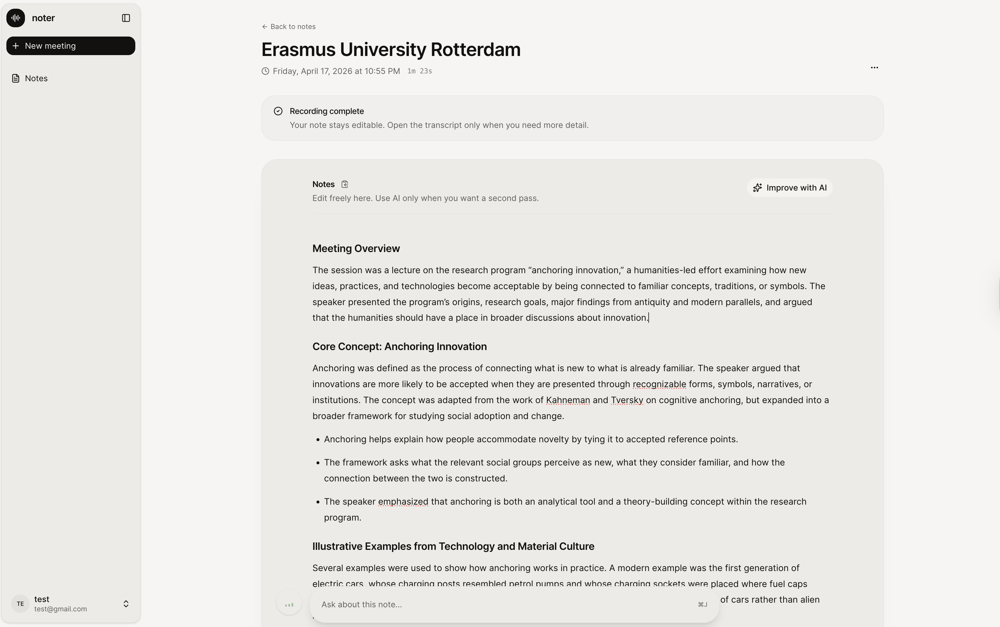

# noter

> AI meeting notes, on your own terms.

[](LICENSE)
[](CONTRIBUTING.md)
[](https://vercel.com/new/clone?repository-url=https://github.com/glebstarchikov/noter)

Record, transcribe, and turn meetings into structured notes with AI — running entirely on your own infrastructure. Self-host on Vercel + Supabase in under 10 minutes.

**Try the live demo →** [my-noter.vercel.app](https://my-noter.vercel.app)



## What it does

- **🎙 Real-time transcription** — Deepgram-powered live transcript with speaker diarization
- **✨ AI-generated notes** — One click turns your transcript into structured notes with action items, decisions, topics, and follow-ups
- **🎨 Customizable templates** — 5 built-in templates (1:1, team meeting, customer interview, lecture, general) plus your own custom prompts
- **💬 Chat with your notes** — Ask questions about a single meeting or across all your notes
- **🔒 Fully self-hostable** — Your audio, transcripts, and notes stay on your Supabase. No third-party SaaS lock-in.

## Tech stack

- **Frontend** — Next.js 16 (App Router), React 19, TypeScript, Tailwind CSS v4, shadcn/ui, Tiptap 3
- **Backend** — Supabase (Postgres + Auth + RLS), Vercel serverless functions
- **AI** — OpenAI via Vercel AI SDK (AI Gateway supported)
- **Transcription** — Deepgram real-time WebSocket (`nova-3` model)
- **Rate limiting** — Upstash Redis (optional, recommended in production for the chat endpoints)
- **Error tracking** — Sentry (optional)

## Self-host quickstart

1. **Fork** this repo and clone it:
   ```bash
   git clone https://github.com/glebstarchikov/noter && cd noter
   bun install
   ```
2. **Set up env vars**: `cp .env.example .env.local` and fill in your keys
3. **Apply migrations**: in your Supabase project's SQL editor, run `scripts/001_*.sql` through `scripts/011_*.sql` in order
4. **Run it**: `bun dev` — open [http://localhost:3000](http://localhost:3000)
5. **Deploy**: push to GitHub, import into Vercel, add env vars, deploy

Full guide with troubleshooting: [/docs/self-host](/docs/self-host)

## Development

```bash
bun install       # install dependencies
bun dev           # start dev server at localhost:3000
bun run build     # production build
bun run typecheck # TypeScript check
bun run lint      # ESLint
bun test          # run tests (310+)
```

## Contributing

Issues and PRs welcome. Read [CONTRIBUTING.md](CONTRIBUTING.md) before opening a PR — covers local setup, testing conventions, and the design language.

For questions or discussion: **open an issue** ([https://github.com/glebstarchikov/noter/issues](https://github.com/glebstarchikov/noter/issues)).

## Security

Found a vulnerability? See [SECURITY.md](SECURITY.md) for the responsible disclosure process. Please **don't** open a public issue.

## License

[MIT](LICENSE) — © 2026 Gleb Starchikov

---

Built for [AI Society](https://github.com/glebstarchikov/noter) and the broader self-hosting community. Star ⭐ the repo if it's useful — it helps others find the project.
