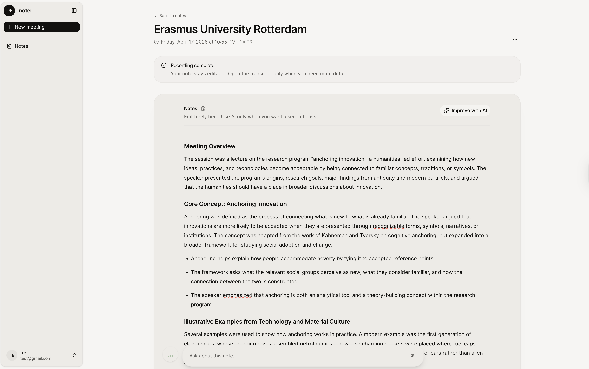

# noter

> AI meeting notes, on your own terms.

[](LICENSE)
[](CONTRIBUTING.md)
[](https://vercel.com/new/clone?repository-url=https://github.com/glebstarchikov/noter)

Record, transcribe, and turn meetings into structured notes with AI — running entirely on your own infrastructure. Self-host on Vercel + Supabase in under 10 minutes.



## Self-host quickstart

1. **Fork** this repo and clone it:
   ```bash
   git clone https://github.com/glebstarchikov/noter && cd noter
   bun install
   ```
2. **Set up env vars**: `cp .env.example .env.local` and fill in your keys
3. **Apply migrations**: in your Supabase project's SQL editor, run `scripts/001_*.sql` through `scripts/011_*.sql` in order
4. **Run it**: `bun dev` — open [http://localhost:3000](http://localhost:3000)
5. **Deploy**: push to GitHub, import into Vercel, add env vars, deploy

Full guide with troubleshooting: [/docs/self-host](/docs/self-host)

## Development

```bash
bun install       # install dependencies
bun dev           # start dev server at localhost:3000
bun run build     # production build
bun run typecheck # TypeScript check
bun run lint      # ESLint
bun test          # run tests (310+)
```
